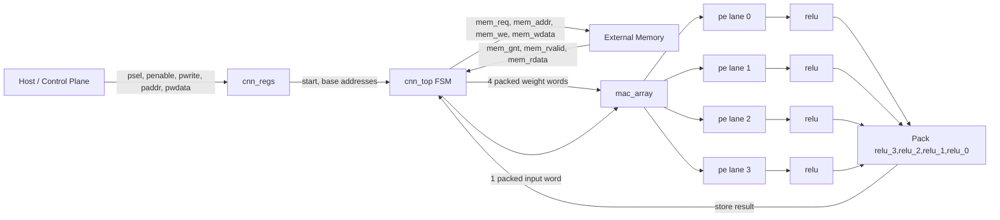
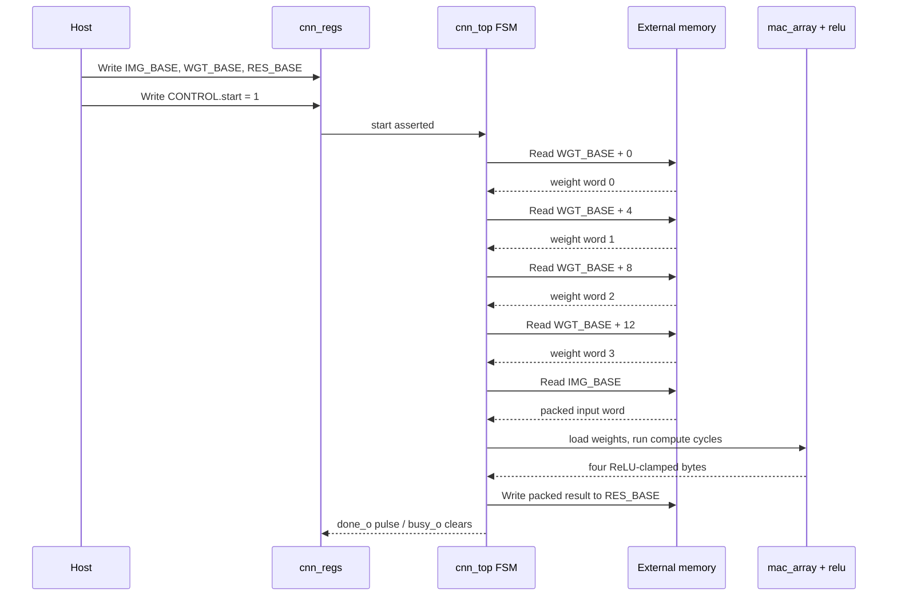

# CNN Accelerator

CNN Accelerator is a small SystemVerilog hardware project centered on `cnn_top`, an APB-like programmable accelerator that reads packed 8-bit weights and inputs from an external memory interface, computes four signed dot products through a four-lane MAC array, applies saturating ReLU, and writes one packed 32-bit result word. The repository also contains simulation testbenches, formal collateral, generic Yosys synthesis scripts, and an OpenROAD-flow-scripts configuration for the SkyWater SKY130 HD platform.

> Scope note: the current synthesized and simulated top-level implements a packed 4-lane MAC/ReLU datapath. Several convolution-oriented helper modules are present in `rtl/`, but they are not instantiated by `cnn_top` and are not included in the active simulation or synthesis source lists.

## Key Features

- APB-like register block for `start`, `busy`, `done`, mode/image metadata, and memory base addresses.
- External request/grant memory interface with read-valid response signaling.
- Four parallel processing elements, each consuming one packed 32-bit weight word and one shared packed 32-bit input word.
- Signed 8-bit multiply-accumulate datapath with 32-bit accumulation.
- ReLU output stage that clamps negative values to `0` and positive overflow to `255`.
- RTL simulation, lint, gate-level simulation targets, and a standalone PE testbench.
- Formal BMC setup for `cnn_top` with environment assumptions and safety assertions.
- Generic Yosys synthesis scripts and committed synthesis outputs.
- OpenROAD-flow-scripts setup for `sky130hd`, including SDC constraints and committed flow logs/results.

## Architecture



## Workflow



## Installation

Install the tools used by the repository flows:

- Icarus Verilog (`iverilog`, `vvp`) for RTL and gate-level simulation.
- Verilator for lint.
- GTKWave for waveform viewing.
- Yosys and `yosys-smtbmc` for synthesis/formal. The checked-in makefiles currently reference `/tmp/yosys-extracted/usr/bin/yosys`.
- Z3 for formal BMC. `dv/fv/run_bmc.sh` currently references `/home/bolter/.local/bin/z3`.
- Docker for the OpenROAD physical-design flow.

See [Getting Started](docs/getting-started.md) for setup details and the hard-coded tool path caveats.

## Quick Start

Run lint and RTL simulation:

```sh
cd dv
make lint
make sim
```

Expected simulation result:

```text
[TB] ALL TESTS PASSED
```

Run generic synthesis when the Yosys path expected by `syn/Makefile` exists:

```sh
cd syn
make synth
```

Run bounded model checking when the Yosys and Z3 paths expected by `dv/fv/run_bmc.sh` exist:

```sh
cd dv/fv
make bmc DEPTH=60
```

Run the OpenROAD flow through Docker:

```sh
cd flow
make synth
make floorplan
make place
make cts
```

The committed `flow/results/sky130hd/cnn_top/cts.log` shows CTS reached clock-tree construction and timing repair, then ended with `child killed: illegal instruction`.

## Usage Example

The RTL testbench programs memory and registers as follows:

```verilog
memory[0]  = 32'h00000001; // PE0 selects input byte 0
memory[1]  = 32'h00000100; // PE1 selects input byte 1
memory[2]  = 32'h00010000; // PE2 selects input byte 2
memory[3]  = 32'h01000000; // PE3 selects input byte 3
memory[64] = 32'h05040302; // packed input {i3=5,i2=4,i1=3,i0=2}

apb_write(8'h10, 32'd256);  // IMG_BASE
apb_write(8'h14, 32'd0);    // WGT_BASE
apb_write(8'h18, 32'd2048); // RES_BASE
apb_write(8'h00, 32'd1);    // CONTROL.start
```

The accelerator writes `32'h05040302` to word address `2048 / 4 = 512`.

## Repository Structure

```text
.
├── README.md
├── CONTRIBUTING.md
├── docs/                         # Architecture, usage, verification, flow docs
├── rtl/                          # Source RTL
├── dv/                           # Simulation testbenches and make targets
│   └── fv/                       # Formal BMC collateral
├── syn/                          # Generic Yosys synthesis scripts and outputs
└── flow/                         # OpenROAD-flow-scripts wrapper, designs, results
```

## Technology Stack

- Language: SystemVerilog/Verilog-2012 style RTL.
- Simulation: Icarus Verilog and VVP.
- Lint: Verilator.
- Formal: Yosys SMT2 generation, `yosys-smtbmc`, Z3.
- Synthesis: Yosys generic synthesis and OpenROAD-flow-scripts synthesis.
- Physical design: OpenROAD-flow-scripts Docker image, `sky130hd` platform.

## Configuration

Main programmable registers:

| Offset | Name | Access | Reset | Description |
| --- | --- | --- | --- | --- |
| `0x00` | CONTROL | R/W | `0` | Bit 0 is `start`. Cleared when `done` is observed by `cnn_regs`. |
| `0x04` | STATUS | R | `0` | Bit 0 is `busy`, bit 1 is `done`. |
| `0x08` | CONFIG | R/W | mode `0`, rows `4`, cols `4` | Bit 0 `mode`, bits `[15:8]` `img_rows`, bits `[23:16]` `img_cols`. Current `cnn_top` does not consume these fields. |
| `0x10` | IMG_BASE | R/W | `0` | 16-bit base byte address for the packed input word. |
| `0x14` | WGT_BASE | R/W | `0` | 16-bit base byte address for four consecutive packed weight words. |
| `0x18` | RES_BASE | R/W | `256` | 16-bit base byte address for the packed result word. |

See [Configuration Reference](docs/configuration.md) and [Usage Guide](docs/usage.md).

## Development Workflow

```sh
cd dv
make lint
make sim

cd ../syn
make synth
```

When touching the top-level datapath, update the RTL simulation tests first. When changing interfaces or FSM behavior, also update formal properties and the documentation in `docs/`.

## Testing

Current checked flows:

- `make lint` in `dv/`: passes in this workspace.
- `make sim` in `dv/`: passes all three testbench scenarios in this workspace.
- `make synth` in `syn/`: blocked in this workspace because `/tmp/yosys-extracted/usr/bin/yosys` is absent.
- `make bmc DEPTH=20` in `dv/fv/`: blocked in this workspace for the same missing Yosys path.

See [Verification Guide](docs/verification.md).

## Documentation

- [Documentation Index](docs/README.md)
- [Architecture](docs/architecture.md)
- [Getting Started](docs/getting-started.md)
- [Usage Guide](docs/usage.md)
- [Configuration Reference](docs/configuration.md)
- [Module Reference](docs/modules.md)
- [Verification Guide](docs/verification.md)
- [Synthesis and Physical Design](docs/synthesis-and-physical-design.md)
- [Development Guide](docs/development.md)
- [Troubleshooting](docs/troubleshooting.md)
- [Limitations and Known Issues](docs/limitations.md)

## Contributing

Read [CONTRIBUTING.md](CONTRIBUTING.md) before changing RTL or flow files. Keep source-list changes synchronized across `dv/Makefile`, `syn/*.ys`, `syn/Makefile`, and `flow/designs/src/cnn_top` when applicable.

## License

No license file is present in this repository, so redistribution and reuse terms could not be inferred from the codebase.
