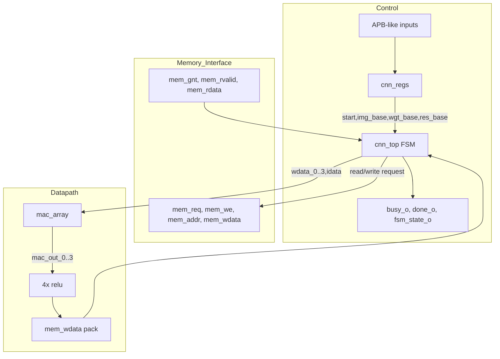
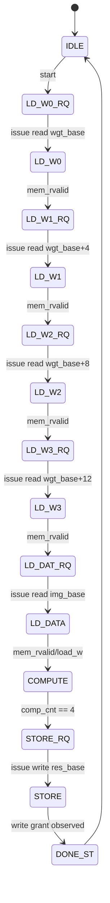
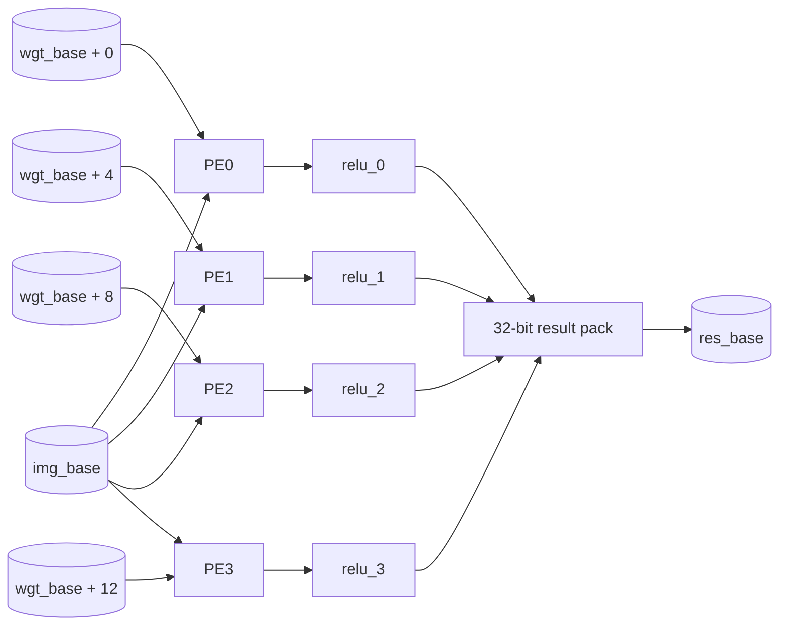

# Architecture

## System Overview

`cnn_top` is the integrated top-level module. It combines:

- `cnn_regs`: APB-like register interface.
- A local FSM inside `cnn_top`: memory sequencing and operation lifecycle.
- `mac_array`: four independent `pe` lanes sharing one packed input word.
- Four `relu` instances: one per PE output.
- A simple external memory command/response interface.

The top-level operation is a single packed 4-output computation:

1. Read four 32-bit weight words from `wgt_base + {0,4,8,12}`.
2. Read one 32-bit input word from `img_base`.
3. Load each weight word into one PE.
4. Run the PE compute enable for five FSM cycles.
5. Clamp each 32-bit result to an unsigned 8-bit ReLU result.
6. Write `{relu_3, relu_2, relu_1, relu_0}` to `res_base`.

## Component Diagram



## Datapath Semantics

Each `pe` stores four signed 8-bit weights from a packed 32-bit word:

```text
wdata = {w3, w2, w1, w0}
idata = {i3, i2, i1, i0}
```

On successive `en` cycles the PE computes:

```text
result = w0*i0 + w1*i1 + w2*i2 + w3*i3
```

The result is signed 32-bit. `relu` maps it to one byte:

- negative signed result -> `8'h00`
- any set bit above bit 7 -> `8'hff`
- otherwise -> low byte

## FSM



`done_o` is high only while the FSM is in `DONE_ST`. `busy_o` is high in every state except `IDLE`. `fsm_state_o` exposes the low four bits of the internal 5-bit FSM state, which is enough for states `0` through `14`.

## Data Flow



## Interfaces

### Control Interface

The register interface uses APB-style names (`psel`, `penable`, `pwrite`, `paddr`, `pwdata`, `prdata`, `pready`) but does not implement wait states. `pready` is tied high.

Writes occur when `psel && penable && pwrite` is true. Reads are combinational through `prdata` based on `paddr[7:0]`.

### Memory Interface

`cnn_top` asserts `mem_req` with `mem_we=0` for reads and `mem_we=1` for writes. When `mem_gnt` is observed while `mem_req` is high, the request is cleared. Read data is captured when `mem_rvalid` is high.

The formal properties assume:

- memory grants within 7 cycles of a request,
- read data returns within 3 cycles of a read grant.

The RTL testbench memory responds quickly: it grants a request and returns read data on the clock edge when `mem_req` is sampled.

## Design Decisions Inferred from Code

- The register block is intentionally always-ready: `pready = 1'b1`.
- Base addresses are stored as 16-bit values and zero-extended to 32-bit memory addresses.
- The top-level is optimized around one packed word of inputs and four packed words of weights, not a streaming image.
- `mode`, `img_rows`, and `img_cols` are programmable but disconnected in `cnn_top`; they appear intended for a broader CNN/convolution mode that is not integrated.
- The active flow source lists are intentionally narrow and include only modules required by `cnn_top`.
